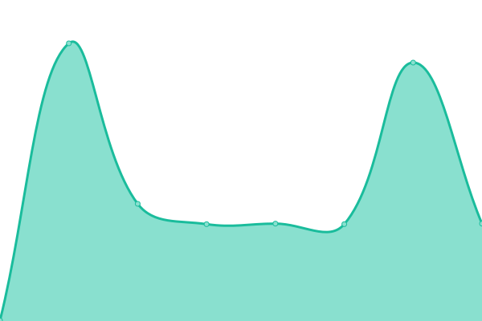

# [📈 Live Status](https://novacSavvyy.github.io/simpliiUptime): <!--live status--> **🟩 All systems operational**

This repository contains the open-source uptime monitor and status page for [novacSavvyy](https://novacSavvyy.github.io/simpliiUptime), powered by [Upptime](https://github.com/upptime/upptime).

With [Upptime](https://upptime.js.org), you can get your own unlimited and free uptime monitor and status page, powered entirely by a GitHub repository. We use [Issues](https://github.com/novacSavvyy/simpliiUptime/issues) as incident reports, [Actions](https://github.com/novacSavvyy/simpliiUptime/actions) as uptime monitors, and [Pages](https://novacSavvyy.github.io/simpliiUptime) for the status page.

<!--start: status pages-->
<!-- This summary is generated by Upptime (https://github.com/upptime/upptime) -->
<!-- Do not edit this manually, your changes will be overwritten -->
<!-- prettier-ignore -->
| URL | Status | History | Response Time | Uptime |
| --- | ------ | ------- | ------------- | ------ |
|  [Simplii Dev](http://dev.admin-web-simplii.savvyy.io/) | 🟩 Up | [simplii-dev.yml](https://github.com/novacSavvyy/simpliiUptime/commits/HEAD/history/simplii-dev.yml) | 

 414ms
     
 | 

<a href="https://novacSavvyy.github.io/simpliiUptime/history/simplii-dev">100.00%</a>
    

|  [Simplii Release](http://release.admin-web-simplii.savvyy.io/) | 🟩 Up | [simplii-release.yml](https://github.com/novacSavvyy/simpliiUptime/commits/HEAD/history/simplii-release.yml) | 

 396ms
     
 | 

<a href="https://novacSavvyy.github.io/simpliiUptime/history/simplii-release">100.00%</a>
    

|  [Simplii Alpha](http://alpha.admin-web-simplii.savvyy.io/) | 🟩 Up | [simplii-alpha.yml](https://github.com/novacSavvyy/simpliiUptime/commits/HEAD/history/simplii-alpha.yml) | 

 391ms
     
 | 

<a href="https://novacSavvyy.github.io/simpliiUptime/history/simplii-alpha">100.00%</a>
    

|  [Simplii Beta](http://beta.admin-web-simplii.savvyy.io/) | 🟩 Up | [simplii-beta.yml](https://github.com/novacSavvyy/simpliiUptime/commits/HEAD/history/simplii-beta.yml) | 

 536ms
     
 | 

<a href="https://novacSavvyy.github.io/simpliiUptime/history/simplii-beta">96.39%</a>
    

|  [Simplii Gamma](http://gamma.admin-web-simplii.savvyy.io/) | 🟩 Up | [simplii-gamma.yml](https://github.com/novacSavvyy/simpliiUptime/commits/HEAD/history/simplii-gamma.yml) | 

 381ms
     
 | 

<a href="https://novacSavvyy.github.io/simpliiUptime/history/simplii-gamma">100.00%</a>
    

<!--end: status pages-->

[**Visit our status website →**](https://novacSavvyy.github.io/simpliiUptime)

## 📄 License

- Powered by: [Upptime](https://github.com/upptime/upptime)
- Code: [MIT](./LICENSE) © [novacSavvyy](https://novacSavvyy.github.io/simpliiUptime)
- Data in the `./history` directory: [Open Database License](https://opendatacommons.org/licenses/odbl/1-0/)
